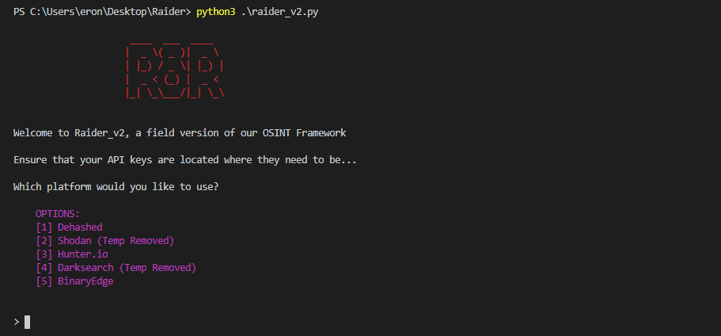
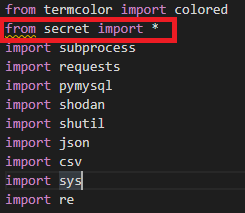

# Raider

Raider is an OSINT tool written in python3 for use in professional assesments. It can be used on both Windows and Linux. 

Ensure that you have an up to date version of pyhton3 on your system. 

To ensure that Raider will run out of the box, be sure to download the following python libraries.

Accomplish this by using `pip3 install ______` (We need python3 compatible libraries, hence pip3)

Create a new directory under any name, store the raider_v2.py and secret.py files in this directory. This directory is where your clients information will be stored as CSV files are created. 

Accounts and API keys are necessary to query the various platforms included in Raider. Some of these subscriptions are paid.   

https://www.dehashed.com/api

https://developer.shodan.io/

https://hunter.io/api

https://www.binaryedge.io/

https://darksearch.io/

Once accounts have been made, place your API keys in the secret.py file. If you would like to change the name of the secret.py file for obscurity, please be sure that the code reflects the change. This file also MUST be in the same directory as raider_v2.py. 

 

As you interact with the Raider application, the results of the queries fired off are stored in your current working directory as CSV files. 

 

